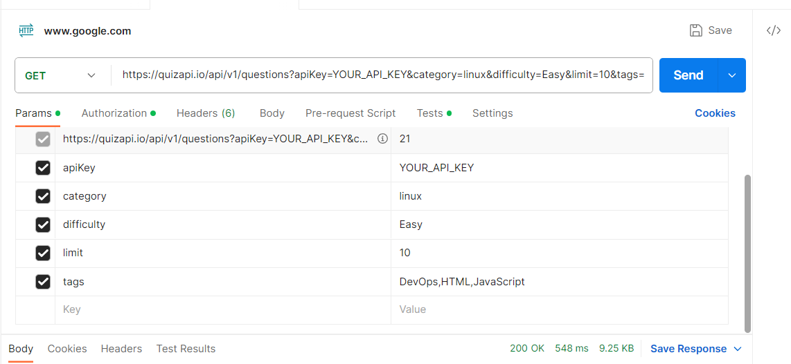
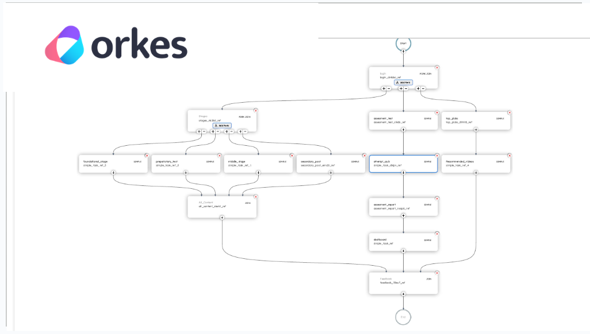

# OPIN-HACKS HACKATHON
### TEAM NAME: GDSC GHRCE ALPHA

| TEAM LEADER                    | MEMBER                    | MEMBER                     | MEMBER                    |
| --------------------------- | --------------------------- | --------------------------- | --------------------------- |
| AMAN TIWARI| RUTUJA BALPANDE | AYUSH CHAWARE | KAUSTUBH SARAF |

---
## 🧑🏻‍💻Problem Statement: Enhancing Smart Education for New Education Policy
### Description:
This software is a platform to access the student might be of any age to maximize academic Potential to avoid Misstep in Career Choice.
Useful for school/universities to a lot student perfect grade to making balance of IQ of Student
Those who left studies due to some reasons and hesitate to resume studies, this shall increase the confidence level and moral importance of the person to pursue future education.
Ultimately leading to more fulfilling and successful educational and professional journeys.
AI and ML revolutionize industries by automating tasks, predicting trends, and enhancing decision-making. They power applications in healthcare, finance, marketing, autonomous vehicles, and more. From personalized education to cybersecurity, these technologies drive efficiency, intelligence, and innovation across various sectors, transforming the way we operate. 

---

## Best use of Sponsors:

- Used Auth0 for *SignIn/SignUp Via Google*.

 Screenshots: 
 
 
---

- Used Postman API workspace for *testing* the *response time* of API which we used in the project. 
Screenshots: 
 

---
)
- Used Orkes for workflow automation. Orkes, the enterprise-grade Conductor platform, simplifies developing and scaling distributed workflows, microservices and events. 
Screenshots: 
 

- Used Quine and Github for making our project *open for all*.
 

---
## TECH STACK USED🧑🏻‍💻

